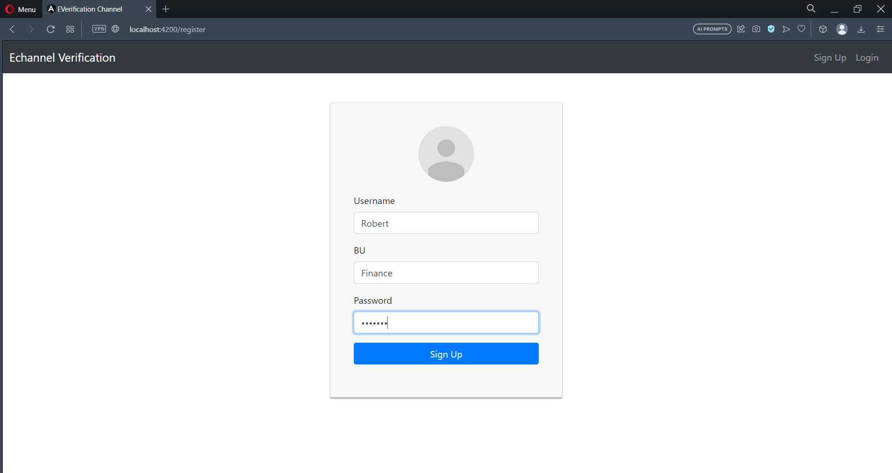
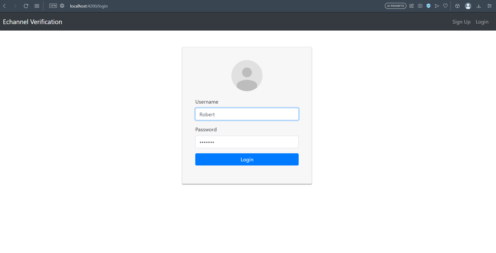
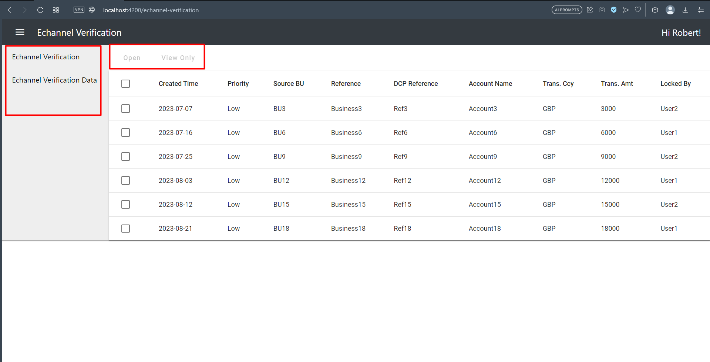
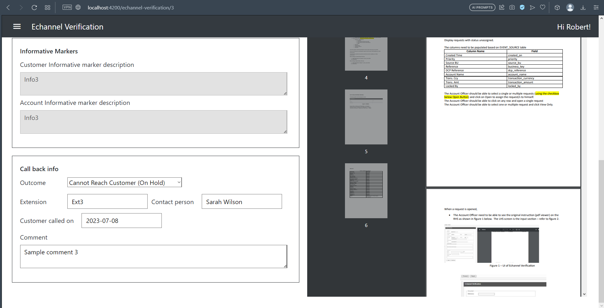
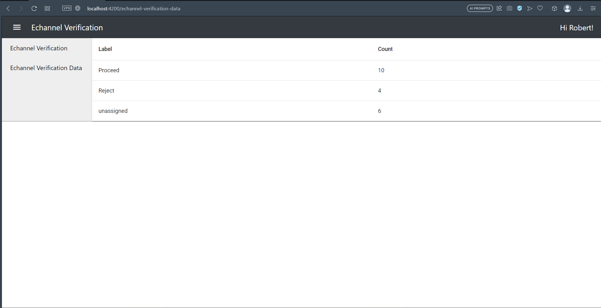

# Echannel Verification

### Getting Started

* Get API code from [GitHub](https://github.com/nelsonfernandoe/nagarro-everification-api)
* Get UI code from [GitHub](https://github.com/nelsonfernandoe/nagarro-everification-ui)
* Start up the API & UI servers
* UI server runs by default on 4200 & API server on 8080
* [Register](http://localhost:4200/register) a new user by providing new username, business unit & password
* 
* Once registered, use [Login](http://localhost:4200/login) url to enter into the application as shown below
*  
* Once logged in, click on the one of the 2 available sidebar menus. 
* The first menu [Echannel verification](http://localhost:4200/echannel-verification) will show the request with unassigned status
* 
* Here you can select one request and click **Open** to assign the request to yourself
* Or you can select more than one request and click **View Only** to open all the selected request in new tabs (in read only mode)
* From the table you can click on any request (table row) to open the editing page 
* 
* Once editing is done, you can submit the form using either **Proceed** or **Reject**
* 

* The second menu [Echannel verification data](http://localhost:4200/echannel-verification-data) will show the request with unassigned status
* 

### Notes

* To logout please clear the browser session storage using developer tool
